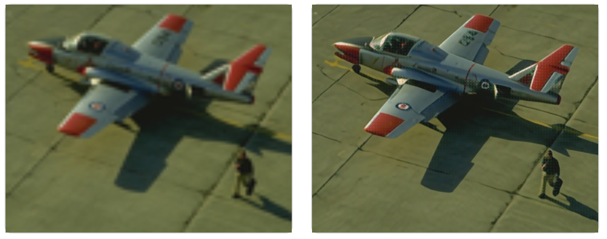
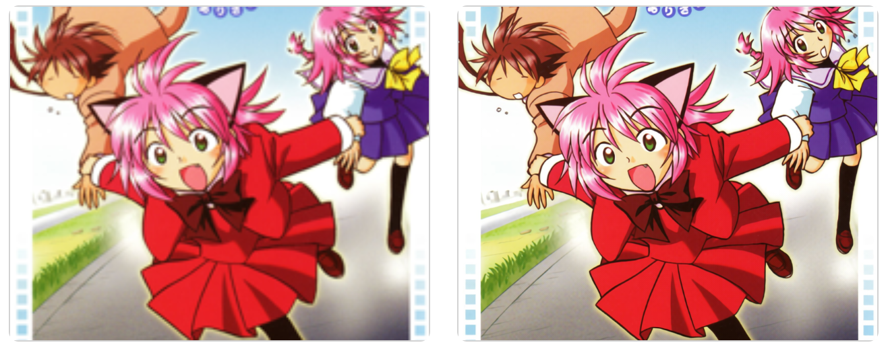
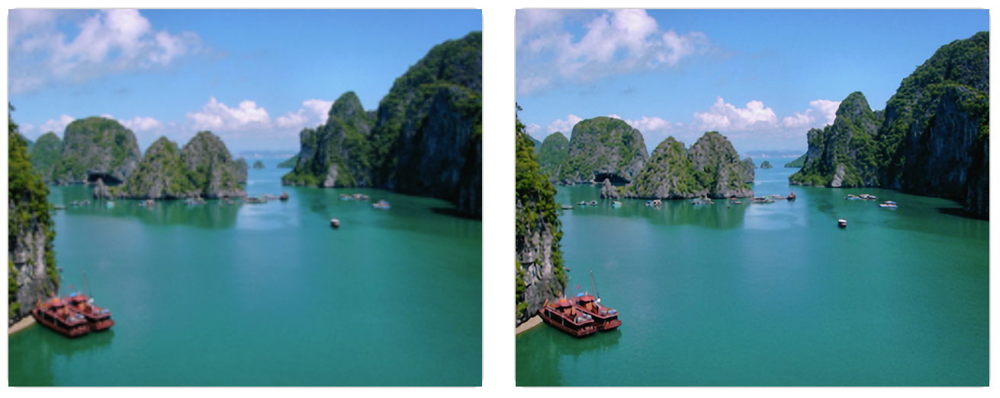
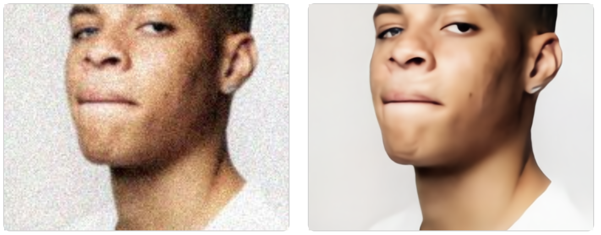

# HAT-experiment [[Web Demo](https://ngoduythinh250601.github.io/SISR-UI)]

### Reference to [Activating More Pixels in Image Super-Resolution Transformer](https://arxiv.org/abs/2205.04437)

## Overview 

If you want detailed information about the dataset, training results and visualization, visit 
[here](https://ngoduythinh250601.github.io/SISR-UI/comparison/).

### Training results

**PSNR benchmark results on SRx4.**
| Model                         | Set5  | Set14 | BSD100 | Manga109 |
| ----------------------------- | :---: | :---: | :----: | :------: |
| HAT-S original                | 32.52 | 28.93 | 27.81  |  31.54   |
| HAT-S applies Patch-Mosaic    | 32.55 | 28.91 | 27.80  |  31.45   |
| HAT-S applies Perceptual Loss | 24.83 | 22.72 | 22.25  |  23.75   |
| HAT-S applies MixLosses Loss  | 32.25 | 28.66 | 27.57  |  31.37   |

**PSNR benchmark results on SRx8.**
| Model                         | Set5  | Set14 | BSD100 | Manga109 |
| ----------------------------- | :---: | :---: | :----: | :------: |
| HAT-S original                | 27.03 | 24.96 | 24.86  |  24.32   |
| HAT-S applies Patch-Mosaic    | 27.01 | 24.97 | 24.85  |  24.19   |
| HAT-S applies Perceptual Loss | 22.74 | 22.00 | 22.25  |  21.18   |
| HAT-S applies MixLosses Loss  | 26.87 | 24.86 | 24.78  |  24.34   |

### Visualization
**HAT-S applies Patch-Mosaic with upscale x4**


**HAT-S applies Perceptual Loss with upscale x4**



**HAT-S applies MixLosses Loss with upscale x4**



## HAT-S for specific tasks

### Training results

**Benchmark results using PSNR scores on HAT-S trained on the VietnameLandscape dataset.**
| Model                  | Upscale | VietnamLandscape | Set5  | Set14 | BSD100 |
| ---------------------- | :-----: | :--------------: | :---: | :---: | :----: |
| HAT-S for VN landscape |   x4    |      25.98       | 32.44 | 28.76 | 27.75  |
| HAT-S for VN landscape |   x8    |      23.67       | 26.98 | 24.93 | 24.84  |

**Benchmark results using PSNR scores on HAT-S trained on the HumanFaces dataset.**
| Model                     | Upscale | HumanFaces | Set5  | Set14 | BSD100 |
| ------------------------- | :-----: | :--------: | :---: | :---: | :----: |
| HAT-S denoise Human Faces |   x4    |   28.37    | 28.94 | 26.40 | 26.09  |
| HAT-S denoise Human Faces |   x8    |   24.90    | 25.16 | 23.60 | 23.91  |

### Visualization
**HAT-S for VN landscape SRx4 with upscale x4**



**HAT-S denoise Human Faces with upscale x4**



## Environment
- [PyTorch >= 1.7](https://pytorch.org/) **(Recommend **NOT** using torch 1.8!!! It would cause abnormal performance.)**
- [BasicSR == 1.3.4.9](https://github.com/XPixelGroup/BasicSR/blob/master/INSTALL.md) 
### Installation
Install Pytorch first.
Then,
```
pip install -r requirements.txt
python setup.py develop
```

## How To Test
- Refer to `./options/test` for the configuration file of the model to be tested, and prepare the testing data and pretrained model.  
- The pretrained models are available at `./deploy/pretrained_models/` or 
[Google Drive](https://drive.google.com/drive/folders/1ELuwIMZQblXHiDKTxcds2nNZ1eo53En1?usp=sharing)
- Then run the following codes (taking `HAT-S_SRx4_from_scratch.pth` as an example):
```
python hat/test.py -opt options/test/HAT-S_SRx4_from_scratch.yml
```
The testing results will be saved in the `./results` folder.  

**Note that:**
- Refer to `./options/test/HAT-S_LR.yml` for **inference** without the ground truth image.
- The tile mode is also provided for **limited GPU memory** when testing. Refer to `./options/test/HAT-S_tile_examples.yml`.

## How To Train
- Refer to `./options/train` for the configuration file of the model to train.
- All the datasets can be downloaded at the [Google Drive](https://drive.google.com/drive/folders/1cbHDFNmvPoBAbo-GX39mcJp8hP86Gv7T?usp=sharing).
```
python hat/train.py -opt options/train/train_HAT-S_SRx4_from_scratch.yml
```
- Note that the default batch size per gpu is 4, which will cost about 12G GPU memory.

The training logs and weights will be saved in the `./experiments` folder.

## Results
The inference results on benchmark datasets are available at
[Google Drive](https://drive.google.com/drive/folders/1JPPVPAAxsGEKKDn_jUu6TBtan91uyBkq?usp=sharing).


## Contact
If you have any question, please email ngoduythinh250601@gmail.com or email truongnnse150331@fpt.edu.vn.